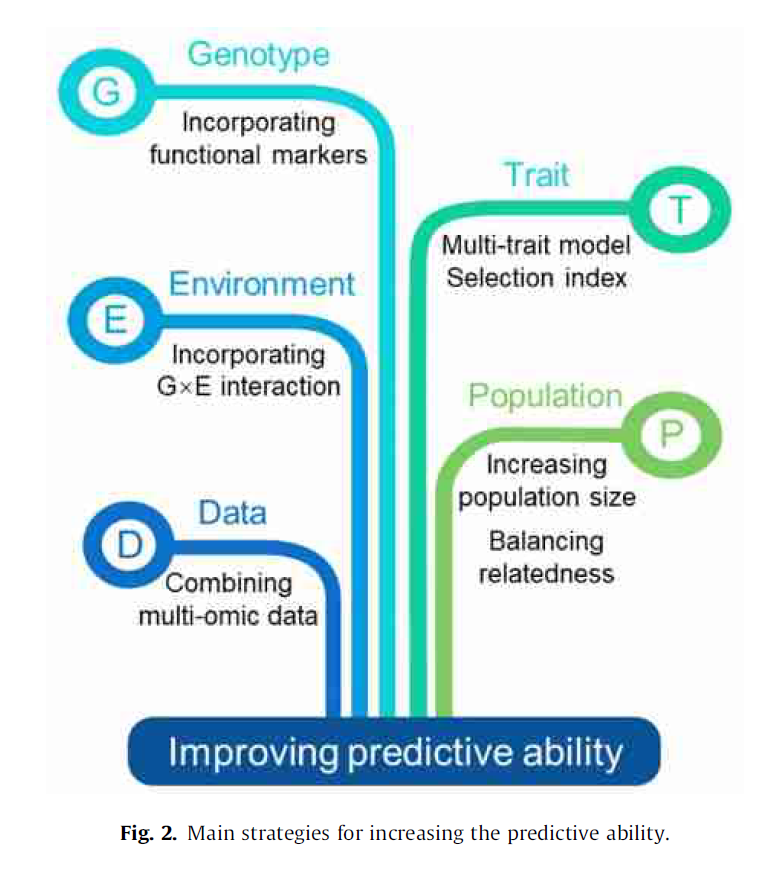
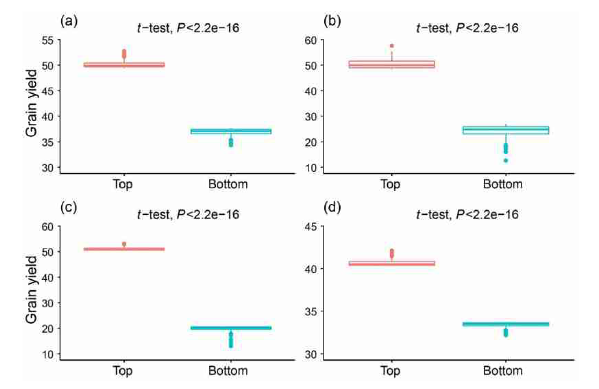

[TOC]
## Genomic selection A breakthrough technology in rice breeding

#### 摘要：

水稻(Oryza sativa)是世界上一半以上人口的主食。然而，目前的水稻育种产量增长速度不足以满足不断增长的全球人口的粮食需求。
基因组选择(GS)具有加速育种进展的巨大潜力，并且通过在表型测量之前进行早期选择具有成本效益。先前的模拟和实验研究已经证明了GS在水稻育种中的有效性。然而，在执行GS时需要仔细考虑几个影响因素和限制。本文综述了影响GS预测性能的主要遗传和统计因素，以及GS在水稻育种中的应用研究进展。此外，我们还提出了提高多种模型预测能力的有效策略，包括结合功能标记的GS模型、环境互作的基因型模型、多性状模型、选择指数模型和多组学数据模型。最后，我们展望了GS与其他先进育种技术的集成，如无人机和开源育种平台，将进一步提高效率和降低育种成本。

#### 1. 引言

水稻育种的主要任务是培育高产、营养丰富、抗病虫害和气候智能型品种。传统的以亲本杂交和后代表型选择为基础的育种是费时的。开发和发布一个新的水稻品种需要大约10年的时间。自20世纪90年代以来，分子技术的进步使育种者能够利用DNA标记辅助选择。利用标记辅助选择技术(MAS)选择具有QTL相关标记的个体。
虽然MAS可以缩短育种时间，但不太适合用于受多基因影响的数量性状，影响较小的基因。基因组选择(GS)被认为是一种很有前途的工具，可以克服上诉局限性。GS利用来自训练群体的目标性状的全基因组DNA标记和表型来预测测试群体中候选群体的基因组估计育种值(GEBVs)，后者已经被基因分型，但没有表型。与传统MAS相比，GS不需要检测到与感兴趣性状相关的显著QTL，而且由于GS在收集表型数据之前就进行筛选，大大提高了育种效率。由于在提高动物育种遗传增益方面取得了巨大的成功，GS被引入作物育种的许多方面，如自交系性能预测、亲本选择、杂交预测等。应用于杂交育种时，GS更有效，因为杂种的基因型可以从亲本基因型推导出来，而不是重新测序，大大降低了测序成本[^1]。近年来，水稻GS在水稻育种中的应用已被若干模拟和实验研究证实[^2][^3][^4][^5][^6]。

高预测精度是GS方法成功应用的前提。预测准确性通常是通过观察表型与预测GEBVs或预测表型(预测能力)之间的相关性来衡量的，使用k倍交叉验证(CV)，其中，总体被随机划分为k个大小相等的部分，每个部分使用从其他k-1部分估计的参数进行一次预测。
预测能力受到几个因素的影响，包括群体大小、训练群体内个体之间的亲缘关系、训练与测试群体之间的亲缘关系、性状的遗传力、标记密度、统计模型等。根据育种者的公式，即使是预测能力的微小提高，也可以转化为选择强度强的巨大收益。为了提高产量等复杂性状的预测能力，人们尝试了多种策略。本文简要介绍了GS的主要影响因素，综述了目前水稻GS的应用进展，强调了提高水稻GS预测能力的策略，并对GS在作物育种中的发展前景进行了展望。

#### 2 影响GS的关键因素

##### 2.1 影响预测能力的遗传因素

在作物遗传育种中应用GS时，需要考虑标记密度、样品量、训练群体与测试群体的关系、群体结构、目标性状的遗传力和遗传结构、标记与QTL之间的连锁不平衡等遗传因素。一般来说，预测能力随着标记物强度和样本量的增加而增加，直到达到稳定状态。以363个水稻优良选育系群体为基础的GS，当采用7142个SNPs和73147个SNPs的预测能力无显著差异[^3]。对575个水稻杂交种的2054293个SNPs进行GS试验，结果表明，在5K SNPs处，预测能力达到稳定水平[^2]。训练群体的必要规模与目标性状的遗传力和群体亲缘性有关。对于低遗传力性状(如h2 = 0.2)，训练群体中需要超过1000个个体[^7]。此外，近缘群体的理想大小要比远缘群体的小得多。Guo et al.等人利用三种代表性子集选择方法证明了在训练总体占2% - 13%的情况下可以建立有效的GS模型[^8]。训练群体与测试群体之间的遗传关系是影响预测能力的重要因素，对于基因相似的群体可以实现更准确的预测[^9][^10]。一种普遍的观点认为，在训练群体中增加更多的相关材料，而不是增加不相关材料的训练群体的规模，可以获得更高的预测能力。然而，从长远来看，增加亲缘关系将损害遗传增益，因为如果相关种群被过度利用，遗传变异将受到限制或耗尽。因此，在实际育种中，应平衡和优化训练群体与测试群体之间的关系[^11]。群体结构影响了分层群体的基因组预测性能，导致标记和性状之间存在虚假关联，从而给出有偏差的效应估计和预测能力。标记与QTL之间的LD程度也影响GS。随着代数的增加，标记与QTL之间的LD会逐渐减小，因此为了保持预测能力，训练群体需要定期更新。预测能力与性状的遗传力密切相关。Jia等人[^12]证明通过交叉验证计算出的遗传力等同于性状预测能力。高遗传力的性状如株高往往比低遗传力的性状如籽粒产量具有更高的预测能力。

#### 2.2 GS的统计模型

除了上述遗传因素外，统计方法还是影响预测能力的另一个重要因素。对于GS，已经使用了大量参数和非参数统计方法。参数方法主要包括基因组最佳线性无偏见预测（GBLUP），脊回归最佳线性无偏析预测（RRBLUP），部分最小二乘（PLS），最小绝对的收缩选择操作员（LASSO），elastic net 和贝叶斯方法（Bayesa，Bayesb， Bayesc，Bayescp，Bayesr和Bayesian Lasso等）;非参数方法包括随机森林（RF），支持向量机（SVM），再现内核HILBERT空间（RKHS），深度学习等。 GBLUP方法假定相同的遗传方差后的所有标记，并使用基因组关系基质来预测表型，而无需估计标记效应。因此，GBLUP方法是稳健且快速的，并且更适合高度多基因性状。 RRBLUP已被证明在数学上等同于GBLUP。LASSO、弹性网和岭回归等变量选择方法使大多数位点的效应趋近于零，与主基因控制的性状数据吻合较好。贝叶斯方法的主要特点是允许不同的标记遵循特定的先前分布[28]。例如，BayesB假设一个两组分的混合先验分布，其中一个组分是点质量在0，另一个是一个标度t分布。 BayesR假设混合了四个正态分布的混合物和一个零方差的混合物，考虑了具有主要、中等、次要或无影响的标记。通常使用Markov链蒙特卡罗（MCMC）算法估计贝叶斯方法的未知参数，从而产生高计算负担。仿真研究表明，贝叶斯方法对特征的遗传架构敏感，它们对具有大效应的性状更好[30]。 SVM和RKHS方法是基于内核的分类和回归的监督学习方法，对于捕获非添加性效应更有效[31,32]。 RF方法是通过引入两层随机性来构建称为森林的大量树木，是数据的随机自动启动采样，另一个是每个节点处的预测器子集的随机选择[33]。此方法占用所有树节点的平均值以找到最佳预测模型。深度学习是具有多个隐藏图层的多层Perceptron，它能够捕获数据中包含的复杂的非线性关系。然而，深度学习需要巨大的数据集以进行准确的预测[34,35]。许多研究人员已经使用模拟和真实数据进行了这些方法的预测能力[36]。但是，没有方法普遍最佳地适合所有数据。徐等人。建议将GS方法视为参数，并评估使用交叉验证的所有可用方法的预测能力，然后选择相应GS程序中最大精度的最佳方法。为方便起见，GS中常用的软件总结在表1中[^Table 1]。

>ANN, (人工神经网络)artificial neural networks; BL, Bayesian LASSO（贝叶斯拉索）; BMM, Bayesian mixture model（贝叶斯混合模型）; BRNN, Bayesian regularization for feed-forward neural network（前馈神经网络的贝叶斯正则化）; BRR, Bayesian ridge regression（贝叶斯岭回归）; CNN, convolutional neural networks(卷积神经网络); DL, deep learning; EN, elastic net（弹性网络）; GBLUP, genomic best linear unbiased prediction; KAML, kinship adjusted multiple loci best linear unbiased prediction（亲属关系调整多位点最佳线性无偏预测）; LASSO, least absolute shrinkage and selection operator（最小绝对收缩和选择算子）; LMM, linear mixed model; NASM, non-additive (HSIC LASSO) statistical models（非加性统计模型）; PLS, partial least squares（偏最小二乘法）; RF, random forest; RKHS, reproducing kernel Hilbert space（重构核希尔伯特空间）; RR, ridge regression; RRBLUP, ridge regression best linear unbiased prediction; SAM, sparse additive models（稀疏加性模型）; SPLSR, sparse partial least squares regression（稀疏偏最小二乘回归）; SVM, support vector machine（支持向量机）.

#### 3.GS在水稻上的应用

3.1 GS在纯和系选择中的应用

GS技术既可用于水稻自交系选育，也可用于杂交育种。目前，水稻GS的研究主要集中在设计训练群体和评估群体内或群体间的预测能力。在水稻育种群体中，已经对各种数量性状进行了基因组预测，并报道了中到高的预测能力(表2)[^Table 2]:。这些研究表明了GS在水稻育种管道中应用的可行性和巨大潜力。Onogi et al.用9种预测方法对110个亚洲水稻品种群体的抽穗期(~ 0.8)、茎长(~ 0.8)、穗长(~ 0.6)、穗数(~ 0.4)、粒长(~ 0.4)和粒宽(~ 0.6)进行了平均预测。Isidro等人利用44K芯片对来自82个国家的413个水稻自交系进行了基因分型。结果表明，分层抽样对每穗小花数、开花期、株高、蛋白质含量的预测能力最高，分别为~ 0.6、~ 0.63、~ 0.7和~ 0.44。Iwata et al.[40]报道了386份水稻品种对稻米粒形的较高预测能力，预测能力约为0.6。Spindel等人对国际水稻研究所(IRRI)灌溉水稻育种项目的363个优良育种系进行了GS分析，对产量、株高和开花期的预测力分别为0.31、0.34和0.63。对旱稻综合群体的343 $S_{2:4}$品系，用贝叶斯套索预测产量(0.309)，用贝叶斯岭回归预测株高(0.538)，用套索预测开花时间(0.295)[41]。基于284个自交系的训练群体，Hassen等人。对36个双亲组合的97个$F_5$-$F_7$系组成的双亲组合的后代预测能力进行了评估，结果表明，后代预测的平均预测能力分别为开花期0.35、氮素平衡指数0.33和百穗重0.38，略低于训练群体交叉验证的预测能力。Yabe等人。利用128个日本水稻品种开发了一种描述粒重分布的方法，并对籽粒灌浆特性进行了GS分析。对与粒重分布相关的重要性状--籽粒充实率和平均粒重进行了预测，预测能力分别为0.30和0.28。除了农艺性状外，Huang et al.提出GS可用于水稻稻瘟病的预测，GBLUP模型在不同菌株间的预测能力在0.15~0.72之间。

> BL, Bayesian LASSO; BRR, Bayesian ridge regression; EN, elastic net; GBLUP, genomic best linear unbiased prediction; LASSO, least absolute shrinkage and selection operator; PLS, partial least squares; RF, random forest; RKHS, reproducing kernel Hilbert space; RR, ridge regression; RRBLUP, ridge regression best linear unbiased prediction; SVM, support vector machine; wBSR, weighted Bayesian shrinkage regression.

##### 3.2 GS在杂交育种中的应用

杂交育种是利用杂种优势提高水稻产量的主要手段。杂交水稻比近交稻有20%的产量优势[44]。水稻杂交育种的最大挑战在于从众多潜在杂交组合中筛选出理想的杂交种。由于资源有限，评估所有潜在杂交种的田间表现是不现实的。幸运的是，GS已经为解决问题铺平了道路。在杂交水稻育种中，GS预测一组给定基因型亲本的所有组合的表现，只需在田间评估所有潜在的4个杂交组合中的一小部分，这大大节省了杂交和田间试验的成本[10]。徐等人首次提出。[9]利用GBLUP法预测水稻杂种性能，其标记为亲缘关系矩阵，而不是杂交种的系谱信息。他们从珍汕97与明恢63杂交而来的210个重组自交系中随机配对278个杂交组合作为训练群体，并预测了其余21,667个未测试的杂交种。五次交叉验证对产量和千粒重的预测能力分别为0.36和0.82。他们预测，与所有21,945个潜在杂交组合相比，选择前100个杂交组合将导致粮食产量增加16%。本研究为水稻杂种预测提供了概念验证。对于更广泛的种质资源的普遍应用，必须使用包含杂交子集的实验设计。Wang等人。[7]利用北卡罗来纳州交配设计$II$(NC $II$)预测水稻杂交性能。以115个自交系与5个不育系杂交产生的575个杂交种为训练群体，预测了115个自交系间6555个潜在杂交组合的表现，发现前100个组合的平均预测产量(51.78)远远高于所有潜在杂交组合的预测产量(38.94)。

> Fig. 1 预测谷物产量的前200个杂交种和所有潜在杂交种中最差的200个杂交种的比较。(A)徐等人预测的所有21,945个杂交种中排名前200的杂交种和倒数200个杂交种。[9]。(B)王等人预测的所有6555个杂交种中排名前200位的杂交种和排名后200位的杂交种。[7]。(C)徐等人预测的所有362,760个杂交种中排名前200位的杂交种和排名后200位的杂交种。[10]。(D)崔等人预测的44,636个杂交种中排名前200位的杂交种和排名后200位的杂交种。[46][老外谈]。

本研究证明了NC$II$设计在水稻杂种预测中的有效性。一些公开的种质和数据为水稻杂交育种提供了很好的机会。例如，3000水稻基因组计划(3K RGP)对从89个国家收集的3000多份不同的种质进行了测序[45]。3K RGP总共释放了2900万个SNP。基于575个杂交种的相同训练群体，Xu等人。[10]对来自3K RGP的362,760份水稻品系与3023份材料间的362,760个潜在杂交组合的表现进行了预测，预测的前100个组合的平均产量比所有潜在组合的平均产量提高了35.5%。最近，崔等人提出了自己的观点。[46]提出了一种新的策略，利用现有的杂交种作为训练群体，从看似不相关的亲本中预测杂交种，从而以最小的成本选择出优良的杂交种。为了验证这一策略，他们使用现有的1495个杂交水稻群体作为训练群体，预测了100个杂交后代，这些杂交后代来自21个亲本的半双列杂交，这些杂交不包括在训练群体的亲本中。对6个性状有较高的预测能力，证明了该策略的可行性。他们还利用这个训练群体从3K RGP中预测了44,636个三系交配系统中的潜在杂交种，并根据所有性状的选择指数选择了200个预测的杂交种。为了直观地展示上述研究的杂交预测结果，在Xu等人预测的21,945,6555,362,760和44636个潜在杂交组合中，绘制了顶部200个和底部200个组合的产量框图。[9]，Wang et al.。[7]，Xu et al.。[10]和崔等人的研究成果[46].[^Figure 1]。前200名选择对应的平均粮食产量为50.1、50.4、51.0和40.6，后200名选择的平均粮食产量分别为36.9、24.1、19.8和33.4。结果表明，从不同群体预测的前200个组合的产量具有相似的预测值，表明GS在水稻育种中的可靠性。前200个交叉点和后200个交叉点的预测能力存在显著差异。这些顶部和底部的预测交叉可以在现场进一步验证。

>Fig. 2 提高预测能力的主要策略。

然而，将GS应用于水稻育种实践的研究仍然有限，特别是与玉米和小麦等其他主要作物相比。国际玉米和小麦改良中心(CIMMYT)已经在全球玉米育种计划中实施了转基因技术[47]。例如，张等人。[48]设计了一种多亲杂交快速循环基因组选择(RCGS)方法。对18个热带玉米优良品系进行了2次杂交和1次自花授粉，形成0循环(C0)，在墨西哥的4个地点进行了基因型和表型鉴定。选择表型最好的个体作为RCGS周期1(C1)的亲本。对形成C1的基因型个体进行预测，并选择预测最好的品系作为C2的亲本。这个过程重复了更多的周期(C2、C3和C4)，并实现了每年两个周期。C1~C4的实现产量达到0.225 t $ha^{-1}$周期，相当于4.5年育种期的年产量0.1 t $ha^{-1}$，说明GS是一种既能保持遗传多样性又能在短期内获得较高遗传增益的有效育种策略。

#### 4.提高预测能力的策略

##### 4.1 将标记纳入GS模型

已经尝试了几种策略来提高对复杂性状的预测能力(图2)。在GS模型中结合已知基因或已识别SNPs的先验信息，有可能揭示复杂性状的遗传结构，并有望提高预测能力。在一项模拟研究的基础上，Bernardo et al.。[49]建议在已知几个主效基因且每个主效基因对遗传方差的解释大于10%的情况下，这些主效基因在BLUP模型中应作为固定效应而不是随机效应来拟合，以提高预测精度。在缺乏基因先验知识的情况下，GWAS确定的显著或峰值SNPs也可视为固定效应协变量。张等人。[50]研究表明，将可公开获得的GWAS结果中的峰值SNPs作为固定效应纳入其中，可以提高对水稻多样性小组中大多数性状的预测。Spindel等人。[51]提出了一种称为GS+从头GWAS的方法，该方法在相同的GS训练群体上进行的GWAS结果中加入了固定效应的标记。在IRRI水稻育种群体中，该方法在所有性状上都优于其他6种方法，与没有固定效应的模型相比，粮食产量的预测能力提高了12.8%。值得注意的是，结合GWAS和GS的联合策略的效率在很大程度上取决于给定性状的遗传结构。Bian et al.。[52]以及赖斯等人。[53]发现联合策略更适用于多基因背景下影响较大的少数QTN性状。因此，在将这一策略应用于育种计划之前，应该调查目标性状的遗传结构。

##### 4.2 将基因型与环境的交互作用纳入GS模型

在作物育种中，多环境试验一直是例行公事。结合基因型与环境($G \times E$)交互作用，可以在相关环境之间借用信息[54]。一些研究已经开发出适应$G \times E$相互作用的GS模型，并报道这些模型与单一环境对应的模型相比在预测能力上有相当大的提高。López-Cruz等人。[55]对GBLUP方法进行了扩展，该方法通过对所有标记与环境之间的交互作用进行了建模，从而纳入了遗传工程的交互作用。其模型的主要特点是可以将具有跨环境共同影响的标记和具有特定环境影响的标记分开。在育种工作中，这有助于选择适应性强、稳定性好的候选品种。Cuevas等人。[56]进一步将非线性高斯核函数与López-Cruz等人的G E模型相结合，发现基于CIMMYT小麦数据集，他们的模型的预测能力提升高达17%。包括贝叶斯岭回归和贝叶斯B在内的贝叶斯模型也被扩展到处理$G \times E$相互作用[57，58]。在水稻育种中，$G \times E$模型优于单环境GS模型。基于在两种水管理系统下评估的水稻参考种群和后代种群，Hassen等人。[59]首次利用包含$G \times E$互作的GS模型研究了育种适应特定非生物胁迫的有效性，发现$G \times E$模型对两种环境下未观察到的表型的预测能力比单一环境模型平均提高了~30%。Bhandari等人在一个由280个IRRI育种系组成的培训群体中，在有利的和两种可管理的干旱环境下进行了评估。[13]结果表明，当被测群体在至少一个环境下被评估时，包含$G \times E$互作的RKHS模型比单环境GS模型具有高达32%的预测抗旱能力。

##### 4.3 多性状GS模型

在育种实践中，应同时考虑多个性状进行选择。多性状GS模型已被证明有利于提高对低遗传力性状的预测能力。性状之间的遗传相关性和残差相关性为基因组选择提供了额外的信息，从而提高了预测能力[60]。一些单性状GS模型已经扩展到多性状选择，如多变量GBLUP和多变量贝叶斯方法[61，62]。最初的多变量模型假设每个位点同时影响多个性状，或者一个也不影响。程等人。[63]提出了一种通用的多性状BayesCp和BayesB方法，允许每个位点影响多个性状的任意组合，而不是全部。他们开发了一个开源软件JWAS来执行多性状遗传。计算复杂度是多性状遗传算法的主要限制因素。最近，Wang et al.。[60]将HAT方法引入BLUP模型，建立了二元GS(2DGS)模型，避免了交叉验证，大大提高了计算效率。基于210个RILS的水稻数据集，他们证实了2D GS分析获得的任何两个性状的预测能力都高于单性状分析得到的预测能力。

多性状GS模型也可以用来预测那些难以或昂贵评估的感兴趣的性状，如根性状和每块地的籽粒产量，使用便于测量的辅助性状，如株高。Wang等人。[7]利用由辅助变量构成的多变量亲属关系矩阵，建立了多变量GBLUP模型。利用该方法对水稻杂交表现进行预测，结果表明，含两个辅助性状的多变量GBLUP比单变量GBLUP的平均预测能力高6.4%，而含8个辅助性状的多变量GBLUP比单变量GBLUP的预测增益高达26.7%。Sun等人。[64]结果表明，在多变量GS模型中，将高通量表型(HTP)平台测得的冠层温度和植被指数作为粮食产量的辅助性状，与单变量模型相比，预测能力提高了70%。

除多元GS模型外，选择指数还可同时用于多个性状的育种选择。在GS的背景下，构建了基因组选择指数(GEBV)，它是由各个经济价值加权的性状的GEBV的线性组合，用于预测净遗传值和选择亲本[65，66]。最近，Wang et al.。[67]提出了一种选择指数辅助遗传算法，该方法利用选择指数的特点，综合训练群体中辅助性状的信息，对试验群体中遗传力较低的目标性状进行预测。他们评估了该方法在模拟和真实杂交水稻数据集上的预测能力，并得出结论：选择指数辅助GS模型明显优于单一性状GS模型。

##### 4.4 集成多组数据进行混合预测

一些研究表明，对于某些复杂性状，特别是受环境影响较大的产量性状，预测能力往往较低。典型的基因组选择方法不足以捕捉基因与其下游调控因子之间的相互作用[68]。下游‘组’，包括转录组、蛋白质组和代谢组，反映了不同生物层次内部和之间的相互作用[69]。随着组学技术的进步，代谢和转录组数据为几种作物的表型预测提供了新的来源。一些研究人员试图使用亲本转录或代谢数据来预测未观察到的杂交种的表现。

关于转录预测，Frisch等人。[70]首次利用21个亲本自交系的表达谱数据和98个杂交种的表型数据对玉米杂交种的表现进行了遗传分析。基于相同的数据集，Fu et al.。[71]采用多元线性回归、偏最小二乘法、支持向量机和转录组距离四种方法对玉米杂交种的表型进行预测，发现基于转录组距离的预测方法最为准确。Zenke-Philippi等人。[72，73]利用46k芯片数据、2k核心基因表达数据和1k AFLP标记数据对玉米杂交种的产量和干物质含量进行了基因组和转录学预测。在岭回归模型下，对杂种性能的转录预测略好于基因组预测。

对于代谢组预测，Meyer等人。[74]首次利用代谢物对拟南芥生物量进行预测，预测值与真实值的相关性达到0.58。Riedelsheimer等人用两个测定器杂交了285个玉米自交系。[5]对7个农艺性状进行配合力预测，发现130个代谢物的预测精度不低于56,110个SNP标记。Xu等人。[75]利用210个水稻亲本的代谢数据对杂交稻产量进行预测，发现预测能力比基因组预测提高了近一倍。根据代谢物预测的前10个杂交种的产量比平均预测产量高出30%左右。基于18个水稻亲本的代谢谱数据和306个来自双列杂交的杂交种的产量相关性状，Dan等人。[76，77]报告了使用PLS方法进行代谢组预测的高预测能力。利用母体代谢物水平之和、差值和比值分别构建预测模型。

为了充分利用基因组信息，多组数据的联合预测研究受到植物育种工作者的广泛关注。Westhues等人。[69]揭示了将转录数据与亲本测得的基因组数据相结合进行杂交预测的优越性。Wang等人。[78]比较了8种GS方法对三体数据组合的预测能力，结果表明，基因组和代谢数据结合GBLUP方法的预测效果总体上是最好的。

尽管上述研究表明转录组和代谢组都是预测杂交种的有效指标，但仍有一些问题需要进一步探讨。基于转录物和代谢物信息的预测应根据转录物和代谢物图谱的动态性质选择合适的组织和采样时间[79]。此外，目前杂交种的转录组和代谢组数据通常采用相同的基因组数据编码方法。它不可避免地存在偏见，因为转录组和代谢组都不能像基因组那样直接从父母的基因组信息中推断出来。杂交种及其亲本的转录物和代谢物水平之间的定量关系有待进一步研究。在育种实践中，需要考虑提高预测能力和增加成本之间的权衡。除了亲本转录和代谢数据外，亲本表型数据也可以用来预测杂种。最近，徐等人提出了自己的观点。[16]提出了一种将亲本表型与多组体预测模型相结合预测水稻杂交种的新策略。他们证明，将亲本表型与其他任何基因组预测因子相结合，显著提高了水稻产量相关性状的预测能力。纳入父母性状值不需要额外的费用，因为父母性状值总是可以获得的。

#### 5.展望

为进一步加快育种进程，降低育种成本，应将GS与其他先进育种技术和平台相结合。HTP平台能够在受控环境和领域以高精度和低劳动强度获取大规模表型数据[80]。HTP与其他策略相结合可以提高遗传力估计和预测精度。近年来，无人机遥感技术为野外表型研究提供了新的机遇。无人机提供了灵活的平台，并提供厘米分辨率的高质量高光谱数据[81]。UAVS平台获得的植被指数和三维植被冠层结构等次生性状可以纳入GS模型，以提高目标性状和遗传增益的预测能力[82]。为了充分利用无人机的信息，需要进一步研究确定理想的传感器配置，并开发具体的型号和软件。配备无人机平台的GS技术有望成为作物育种中一种有效的常规策略。

在GS育种中，基因分型通常会消耗大量的育种成本。目前，测序基因分型(GBS)技术已被广泛应用于GS研究中获得高密度SNPs，但它需要生物信息学分析程序和繁重的推论以及数据共享的困难[83]。相比之下，SNP阵列是基于标准化的程序和固定的位点设计的，可以应用于大样本的快速基因分型，而且对饲养者来说数据分析很简单[84]。已设计了44K SNP阵列、RICE6K、RiceSNP50、C7AIR等SNP阵列，用于水稻分子育种。最近，张等人提出了自己的观点。[85]分析了3010份水稻材料的45,963个水稻基因的基因-CDS-单倍型(GcHap)多样性，发现基于单倍型的GS比基于SNP的GS具有更高的预测能力，因为相对较少的gcHap代表了大多数水稻基因的功能重要性。然而，几个主要基因还没有完全整合到现有的水稻阵列中。针对水稻GS育种的单核苷酸多态性(SNP)阵列需要为全球水稻群体开发。

为了优化育种效率，还建议使用开源平台进行GS育种[86]。在开源平台上，研究人员和育种者可以共享他们在不同环境中种植的训练种群的基因型和表型数据。基于现有的人口数据集，研究人员可以加强他们自己的GS模型，并更快、更准确地预测局部环境中的候选对象。要联合分析或重用这些数据，需要定义公共标准和数据格式[21]。此外，迫切需要开发新的统计模型，如机器学习，以处理农业数据的爆炸性增长。凭借优化的实验设计、精确的HTP平台、低成本的基因分型技术和改进的模型，GS技术将在全球研究人员的共同努力下，进一步改良水稻品种。

---

#### 参考文献
[^Table 1]:
[^Table 2]:
[^Figure 1]:
[^Figure 2]:
[^1]:S. Xu, D. Zhu, Q. Zhang, Predicting hybrid performance in rice using genomic best linear unbiased prediction, Proc. Natl. Acad. Sci. U. S. A. 111 (2014) 12456– 12461.
[^2]:Y. Xu, X. Wang, X. Ding, X. Zheng, Z. Yang, C. Xu, Z. Hu, Genomic selection of agronomic traits in hybrid rice using an NCII population, Rice 11 (2018) 32.
[^3]:J. Spindel, H. Begum, D. Akdemir, P. Virk, B. Collard, E. Redona, G. Atlin, J.L. Jannink, S.R. McCouch, Genomic selection and association mapping in rice (oryza sativa L.): effect of trait genetic architecture, training population composition, marker number and statistical model on accuracy of rice genomic selection in elite, tropical rice breeding lines, PLoS Genet 11 (2015) e1004982.
[^4]:S. Yabe, H. Yoshida, H. Kajiya-Kanegae, M. Yamasaki, H. Iwata, K. Ebana, T. Hayashi, H. Nakagawa, Description of grain weight distribution leading to genomic selection for grain-filling characteristics in rice, PLoS ONE 13 (2018) e0207627.
[^5]:A. Bhandari, J. Bartholome, T.V. Cao-Hamadoun, N. Kumari, J. Frouin, A. Kumar, N. Ahmadi, Selection of trait-specific markers and multi environment models improve genomic predictive ability in rice, PLoS ONE 14 (2019) e0208871.
[^6]:J. Spindel, H. Iwata, Genomic selection in rice breeding, in: T. Sasaki, M. Ashikari (Eds.), Rice Genomics, Genetics and Breeding, Springer, Singapore, 2018, pp. 473–496.
[^7]:K.P. Voss-Fels, M. Cooper, B.J. Hayes, Accelerating crop genetic gains with genomic selection, Theor. Appl. Genet. 132 (2019) 669–686.
[^8]:T. Guo, X. Yu, X. Li, H. Zhang, C. Zhu, S. Flint-Garcia, M.D. McMullen, J.B. Holland, R.J. Wisser, J. Yu, Optimal designs for genomic selection in hybrid crops, Mol. Plant 12 (2019) 390–401.
[^9]:H.D. Daetwyler, U.K. Bansal, H.S. Bariana, M.J. Hayden, B.J. Hayes, Genomic prediction for rust resistance in diverse wheat landraces, Theor. Appl. Genet. 127 (2014) 1795–1803.
[^10]:X. Wang, Y. Xu, Z. Hu, C. Xu, Genomic selection methods for crop improvement: current status and prospects, Crop J. 6 (2018) 330–340.
[^11]:Y. Xu, X. Liu, J. Fu, H. Wang, J. Wang, C. Huang, B.M. Prasanna, M.S. Olsen, G. Wang, A. Zhang, Enhancing genetic gain through genomic selection: from livestock to plants, Plant Commun. 1 (2020) 100005.
[^12]:Z. Jia, Controlling the overfitting of heritability in genomic selection through cross validation, Sci. Rep. 7 (2017) 13678.

