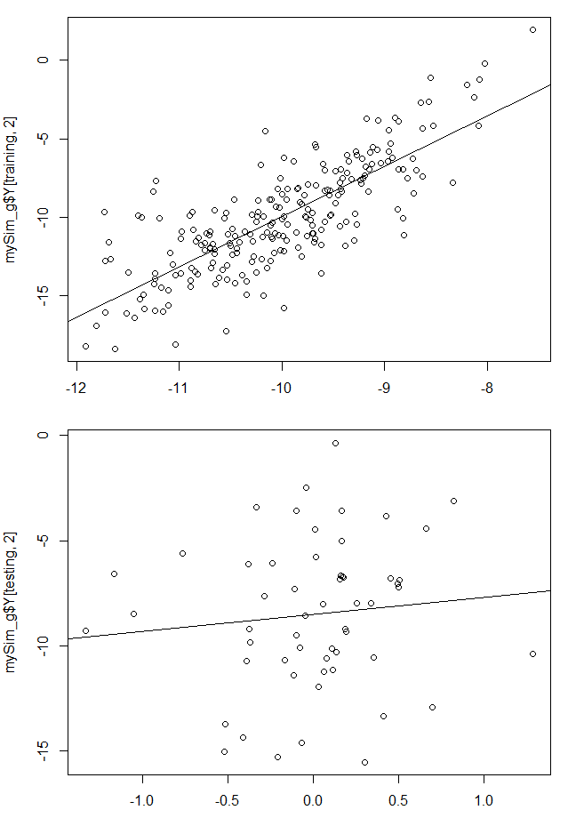

[TOC]


## GS

### 包的学习	--	采用示例数据
1
2
3
4


### 497份按染色体
1
2
3

### 497随机

#### gblup


```R
################---------------------------------------------------------------
setwd("G:/code/R/2021/3/GS")
source("data/GAPIT.library.R")
source("data/gapit_functions.txt")

library(data.table)
################---------------------------------------------------------------
#导入数据
setwd("G:/code/R/2021/3/GS/OM1723/")
myGD=fread(file = "genotype.txt",head=T)#基因型数据（数字格式）
Markers<-myGD[,-1]
myGM=fread(file="snp_info.txt",head=T)#(SNP位置信息)
myY=read.table(file = "phenotype.txt",header = T)
str(myY)
################---------------------------------------------------------------
n=nrow(myY)
train= as.matrix(sample(1:75, 45))
test<-setdiff(1:75,train)

# train set
Pheno_train = myY[train,]
#m_train = Markers_impute2[train,]
m_train = as.matrix(Markers[train,])

# valid set
Pheno_valid = Pheno[test,]
#m_valid = Markers_impute2[test,]
m_valid = as.matrix(Markers[test,])

################---------------------------------------------------------------
#进行gBLUP预测
myGAPIT5<- GAPIT(
                    Y=Pheno_train,
                    GD=Markers,
                    GM=myGM,
                    PCA.total=3,
                    model="gBLUP",
                    SNP.test=FALSE,
                    file.output=F
)
################---------------------------------------------------------------
#以下代码和上面MAS意思类似
order=match(mySim$Y[,1],myGAPIT5$Pred[,1])
myPred=myGAPIT5$Pred[order,]
ry2.blup=cor(myPred[testing,5],mySim$Y[testing,2])^2 #估算试验群体的表型预测准确率
#ru2.blup=cor(myPred[testing,5],mySim$u[testing])^2 #估算试验群体育种值的预测准确率
par(mfrow=c(2,1), mar = c(3,4,1,1))
plot(myPred[testing,5],myY[testing,2])
mtext(paste("R square=",ry2.blup,sep=""), side = 3)
#plot(myPred[testing,5],mySim$u[testing])
#mtext(paste("R square=",ru2.blup,sep=""), side = 3)
```


##  


### 696 随机