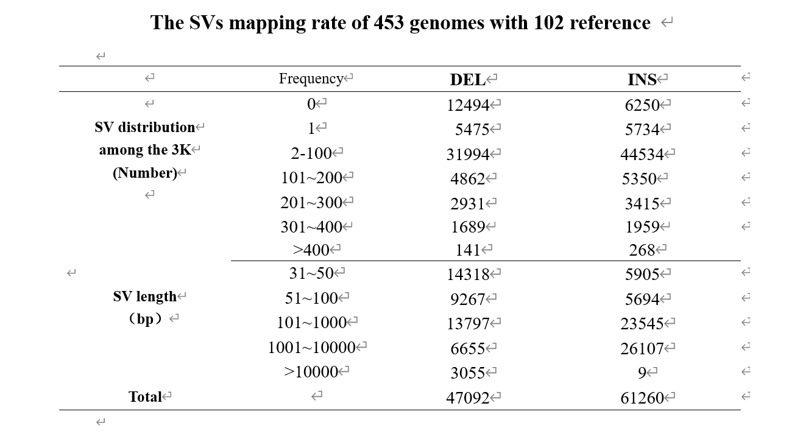

# Results

## 1. The private SVs sets of six wide rice

A total of 2748 SVs were detected in 102 rice reference genomes which is shared by six wild rice from 102 rice. Next we used multiple methods to assess the private SVs sets of wild rice. First, we compared the 2748 SVs for four SV types : insertion (INS),deletion (DEL), duplication (DUP), inversion (INV). For these 2748 SVs, more than half of the SVs with a type of DEL, accounting for 52% of the total , followed by INS (44%) ,a lower proportion (4%) of DUP and the least number is that the total proportion of INV, is only 0.2%(Figure. 1).

Second, to further understand the length distribution of these SVs sets, we performed a frequency statistic based on the length of the SV sequence. In general, the length of SVs are distributed between 31bp to 60000bp. Specifically, as shown in Figure 2, there are a total of 840 SV with a length below 100bp, accounting for 30.57% of the total, while 1098 SV with a length of 100bp ~ 500bp, accounting for 39.96% and this section is also the section with the most SV aggregation. When the SV length reaches the interval of 500bp ~ 1000bp, 240 SVs (8.73%) are gathered in this interval, and there are 450 SVs (16.38%) within the length of 1000 ~ 5000bp. Only a very small part of the length of SV is larger than 5000bp, and the overall proportion is only 4.37%.

Finally, our analyzed the chromosome distribution of private SVs in cultivated rice and wild rice in 102 rice reference genomes based on two sliding window sizes(Figure 3). When we counted the distribution of the two SV sets on the chromosomes based on the sliding window of 1Mb, we found that the results were not significant in terms of the SV sets of cultivated rice, because the overall trend was smooth and there was no large peak(Figure 3-a).But when we resized the sliding window to 100kb, we surprised the peak appearance. more precisely, there were obvious peaks on chromosomes 1, 2, 4, 8, 11 and 12, especially at the end of chromosome 11(Figure 3-c) .However, it is different from cultivated rice that no matter whether the slip window is 100 kB or 1MB, wild rice has a significant peak in chromosome distribution. In particular, when a significant peak appearing in chromosomes in chromosomes in 1, 12 when the slide size is 1MB(Figure 3-b). When the slide size is adjusted to 100kB, the area of the peak of the 1st chromosome is changed from a peak to four peaks, and only one peak is still present on the chromosome of the 10.(Figure 3-d) In addition, there is an interesting phenomenon: where the SV of cultivated rice peak, wild rice tends to be relatively flat, and vice versa.

Figure 1

Figure2

Figure3-a

Figure3-b

Figure3-c

Figure3-d

## 102 reference

We analyzed the distribution of overlapping SVs in SVs set of 102 rice reference genomes and 453 high sequencing depth SVs sets of 3000 cultivated rice from multiple dimensions.

First of all, we classified and counted the successfully matched SVs based on the matching of 102rice reference genomes in 453 rice with high sequencing depth. A total of 127096 SVs in 102 rice reference genomes, of which 108352 SVs matched at least once in 453 materials, with an overall coverage of 85.25%. 

Among the 108352 SVs, the length range of the largest number of aggregated SV is 101bp ~ 1000bp, with a total of 37342 SV (34.46%), followed by the section of 1001bp ~ 10000bp, with a total of 32762 SV (30.24%). The section with the least number of SV aggregates is the section larger than 10000bp, with only 3064 SV (2.83%)（Table1）.Specifically, as shown in Figure 2, there are a total of 840 SV with a length below 100bp, accounting for 30.57% of the total, while 1098 SV with a length of 100bp ~ 500bp, accounting for 39.96% and this section is also the section with the most SV aggregation. When the SV length reaches the interval of 500bp ~ 1000bp, 240 SVs (8.73%) are gathered in this interval, and there are 450 SVs (16.38%) within the length of 1000 ~ 5000bp. Only a very small part of the length of SV is larger than 5000bp, and the overall proportion is only 4.37%.In addition, 18744 SVs （14.75%）did not match successfully, of which a considerable proportion of SVs gathered in the length range of 30bp~50bp, with a total of 6114 SVs (32.62%), followed by a total of 5315 SVs with length between 101bp-1000bp (28.36%) and 3994 SVs (21.31%)were focus on the length range of 51bp ~ 100bp . Then there is the length range of 1000bp-10000bp, with a total of 2950 SV (15.74%), and finally the group with SVs length greater than 10000, which has a total of 371 SVs (1.98%)(Figure 5-1).Besides, among the 108352 SV samples, 11209 SVs（8.82%） were rare SVs which means these SVs were successfully detected in only one material. In the rare SV collection, most of the SV lengths are concentrated between 100bp and 1000bp, with a total of 4037 SV (36.02%). In addition, the number of SV concentrated in the 30bp~50bp interval and the 1001bp~10000bp interval is relatively similar, containing 2510 SV (22.39%) and 2706 SV (24.14%), respectively;the number of SV concentrated between 51bp~100bp is only 1728 (15.42%), while the number of SV with length greater than 10000bp is only 228 (2.03%)(Figure 5-2).Among the 102 rice reference genomes, more than half of the SV matches were only 2-100 copies of the 453 rice genomes. In addition, as far as the SV type is concerned, most of the 18744 unmatched SV are DEL, while in the successfully matched SV, the number of DEL and INS is basically the same, but when the number of matches exceeds 400, INS has the upper hand(Table 1)(Figure 4).

On the other hand, from the perspective of SV type, most of the 18744 unmatched SV are DEL, and among the 108352 successfully matched SV, DEL and INS account for half of the number, but when the number of matches exceeds 400, INS has the upper hand (Figure 4).

Finally, we mapped the distribution of SV on chromosomes based on the location information of 102rice reference genomes. As shown in figure 6, different types of SV are distributed on 12 chromosomes, but there are not four types of SV on each chromosomes . Among these SV, DEL and INS are the most numerous and widely distributed（they are all distributed on 12 chromosomes）, and DEL and INS tend to be in the same position at the same time. However, DUP and INV are different, their numbers are relatively small, they are only distributed on some chromosomes, there is no DUP variation on chromosomes 7 and 11, and the number of DUP mutations on chromosome 4 is the most. In addition, the number of INV mutations was the least, only six, distributed at the end of chromosome 1.

表1

Figure4

Figure5-1 102份参考基因组中未被453份材料中SV匹配到的SV分布

Figure5-2 102份参考基因组中稀有SV的分布 

Figure6

