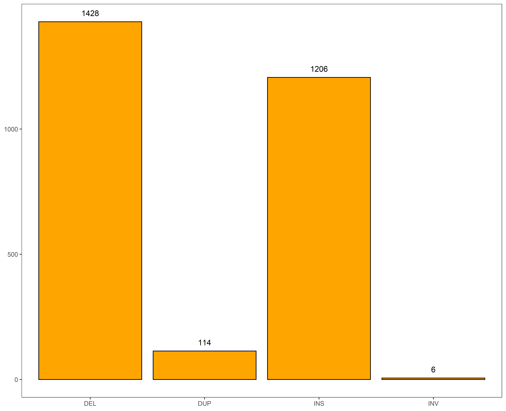
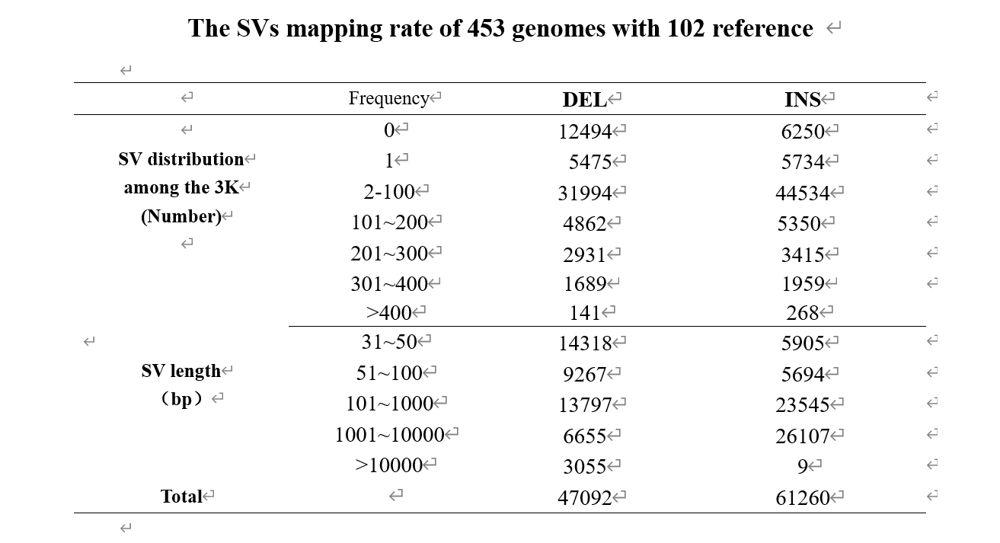

[TOC]
# Results

## 1. 野生稻

We gathered 2748 SVs which is common by six wild rice from 102 rice reference genome SVs sets. Next we used multiple methods to assess the private SVs sets of wild rice. First, we compared the 2748 SVs for four SV categories : insertion (INS),deletion (DEL), duplication (DUP), inversion (INV). For these 2748 SVs, more than half of the SVs with a type of DEL, accounting for 52% of the total , followed by INS (44%) ,a lower proportion (4%) of DUP and the least number is that the total proportion of INV, is only 0.2%(Figure. 1).

Second, to further understand the length distribution of these SVs sets, we performed a frequency statistic based on the length of the SV sequence. In general, the length of SVs are distributed between 31bp to 60000bp. Specifically, as shown in Figure 2, there are a total of 840 SV with a length below 100bp, accounting for 30.57% of the total, while 1098 SV with a length of 100bp ~ 500bp, accounting for 39.96% and this section is also the section with the most SV aggregation. When the SV length reaches the interval of 500bp ~ 1000bp, 240 SVs (8.73%) are gathered in this interval, and there are 450 SVs (16.38%) within the length of 1000 ~ 5000bp. Only a very small part of the length of SV is larger than 5000bp, and the overall proportion is only 4.37%.

Finally, our analyzed the chromosome distribution of private SVs in cultivated rice and wild rice in 102 rice reference genomes based on two sliding window sizes(Figure 3). When we counted the distribution of the two SV sets on the chromosomes based on the sliding window of 1Mb, we found that the results were not significant in terms of the SV sets of cultivated rice, because the overall trend was smooth and there was no large peak(Figure 3-a).But when we resized the sliding window to 100kb, we surprised the peak appearance. more precisely, there were obvious peaks on chromosomes 1, 2, 4, 8, 11 and 12, especially at the end of chromosome 11(Figure 3-c) .However, it is different from cultivated rice that no matter whether the slip window is 100 kB or 1MB, wild rice has a significant peak in chromosome distribution. In particular, when a significant peak appearing in chromosomes in chromosomes in 1, 12 when the slide size is 1MB(Figure 3-b). When the slide size is adjusted to 100kB, the area of the peak of the 1st chromosome is changed from a peak to four peaks, and only one peak is still present on the chromosome of the 10.(Figure 3-d) In addition, there is an interesting phenomenon: where the SV of cultivated rice peak, wild rice tends to be relatively flat, and vice versa.


在102份水稻参考基因组中，针对6个野生稻进行了SV检测，最后发现2748份SV是野生稻中独有的SV。随后对这2748份SV按照类型进行了划分，并可视化为图1。正如图1所示，野生稻中数量最多的SV类型是DEL（1428），INS的数量次之（1206），INV的数量是最少的，仅有6个。


<center>Figure 1</center>

```tex
具体而言，正如图二所示，其中长度在100bp以下的SV一共有840份(30.57%)，长度在100-500bp以内的SV一共有1098份(39.96%)，而长度在500-1000bp以内的SV一共有240份(8.73%)，长度在1000-5000bp以内的SV一共有450份(16.38%)，只有极少部分的SV长度大于5000，仅占总体变异的4.37%。
```

图2是野生稻中SV长度分布的频率统计图，总体来看，SV的长度分布于31bp到60000bp之间。其中长度在100bp以下的SV一共有840份(30.57%)，长度在100-500bp以内的SV一共有1098份(39.96%)，而长度在500-1000bp以内的SV一共有240份(8.73%)，长度在1000-5000bp以内的SV一共有450份(16.38%)，只有极少部分的SV长度大于5000，仅占总体变异的4.37%。


<center>图2</center>

### 1.3 SV在染色体上的分布情况
图3描述了102份参考基因组中野生稻和栽培稻SV在染色体上的分布，图3-a和图3-b分别是栽培稻和野生稻是以1Mb滑窗大小进行SV数目统计的结果，图3-c和图3-d分别是栽培稻和野生稻是以100kb滑窗大小进行SV数目统计的结果。就栽培稻而言，当滑窗大小为1Mb时结果并不显著，没有较大的峰值出现，但是当滑窗大小调整为100kb后，可以看到，在1号染色体的前端和中部位置出现了峰值，2号染色体、4号染色体、10号染色体、11号染色体和11号染色体都有明显峰值出现，尤其是11号染色体的末端SV的数目最高甚至达到了300。就野生稻而言，当滑窗大小为1Mb时，我们可以看出在1号染色体和10号染色体上出现了一共较大的峰值，且都定位于染色体的前端。除2号、6号和8号染色体是SV的分布较为均匀外，其余染色体是均出现了或大或小的峰值。而当我们将滑窗大小调整为100kb以后，可以看到1号染色体和10号染色体的峰值仍然出现出现在了染色体的前半部分，这一点与图3-b一致是一致的。


<center>图3-a</center>


<center>图3-b</center>


<center>图3-c</center>


<center>图3-d</center>

## 102reference

表一的上半部分统计了102份参考基因组在453份3k数据库中高测序深度水稻中SV覆盖情况，而图4则将这一情况进行可视化。102份参考基因组中的SV数目为127096，其中108352份SV在453份材料中至少匹配到了一次，整体覆盖度在85.25%；此外有18744份SV并没有在453份材料中成功匹配，而在这其中大部分SV长度的长度集中在30-50bp，总体占比达32.62%；紧随其后的是长度位于101-1000bp之间的SV，总体占比28.36；随后便是长度位于51-100bp之间SV，共有3994份，占比21.31%；接下来是长度在1000bp-10000bp之间的SV，共有2950份，占比15.74%。此外在108352份SV中还有11209份SV是稀有SV，这些SV均只在一份材料中被成功检测到。稀有SV中，数量最多SV长度区间为100kb-1000kb，一共有4037份，占比36.02%，紧随其后的长度区间为1000kb到10000kb，一共有2706份，占比24.14%。此外就SV类型而言，在未匹配到的18744份SV中，大部分都是DEL，而在成功匹配到的这些SV中，DEL和INS的数量基本相当，但当匹配数量超过400时，INS又稍占上风。
<center>表1</center>



<center>图4</center>


<center>图5-1 102份参考基因组中未被453份材料中SV匹配到的SV分布</center>


<center>图5-2 102份参考基因组中稀有SV的分布 </center>


图6是102份参考基因组中SV在染色体上的分布情况。12条染色体上分布着不同类型的SV，其中DEL和INS数量最多，在12条染色体上都有分布，且DEL和INS往往会同时出现同一位置。此外DUP数量相对较少，只分布在部分染色体上，7号和11号染色体上并没有DUP变异，4号染色体上分布的DUP变异数量最多。此外INV变异的数量是最少的，只有六个，分布于1号染色体的末端。


<center>图6</center>

